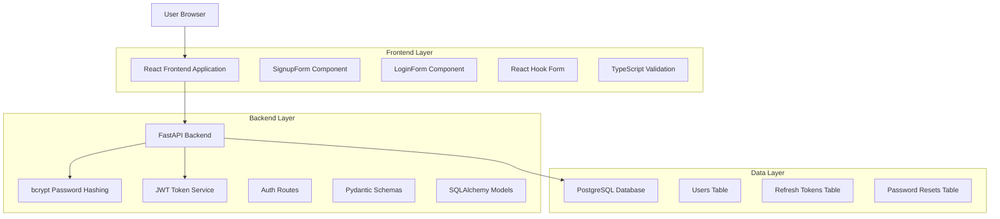
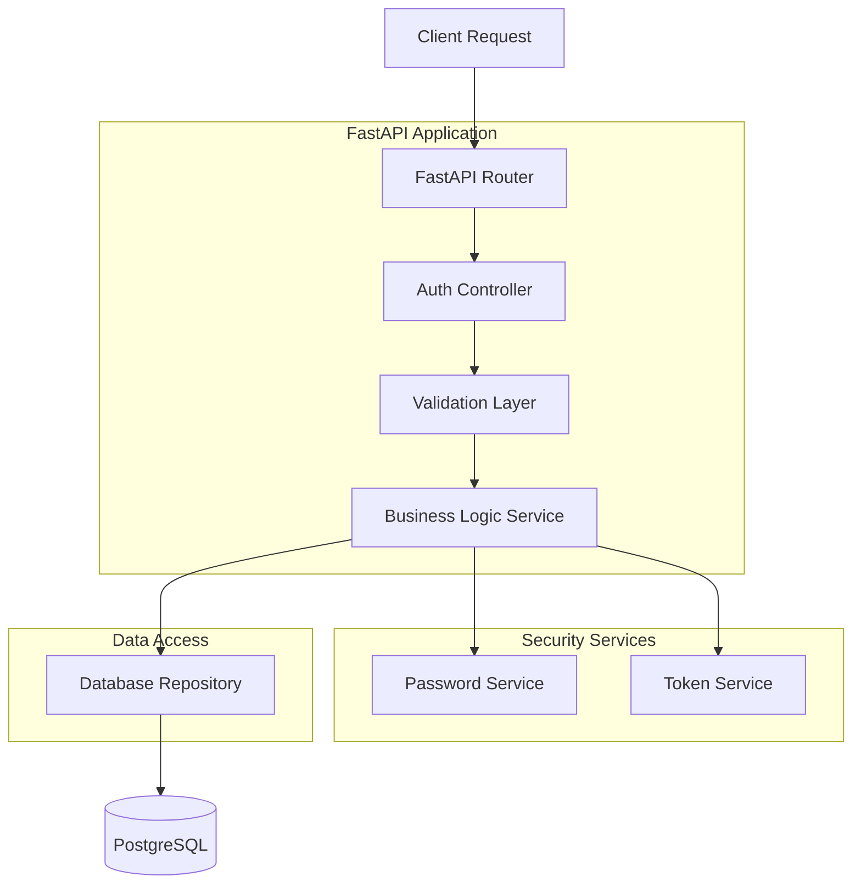
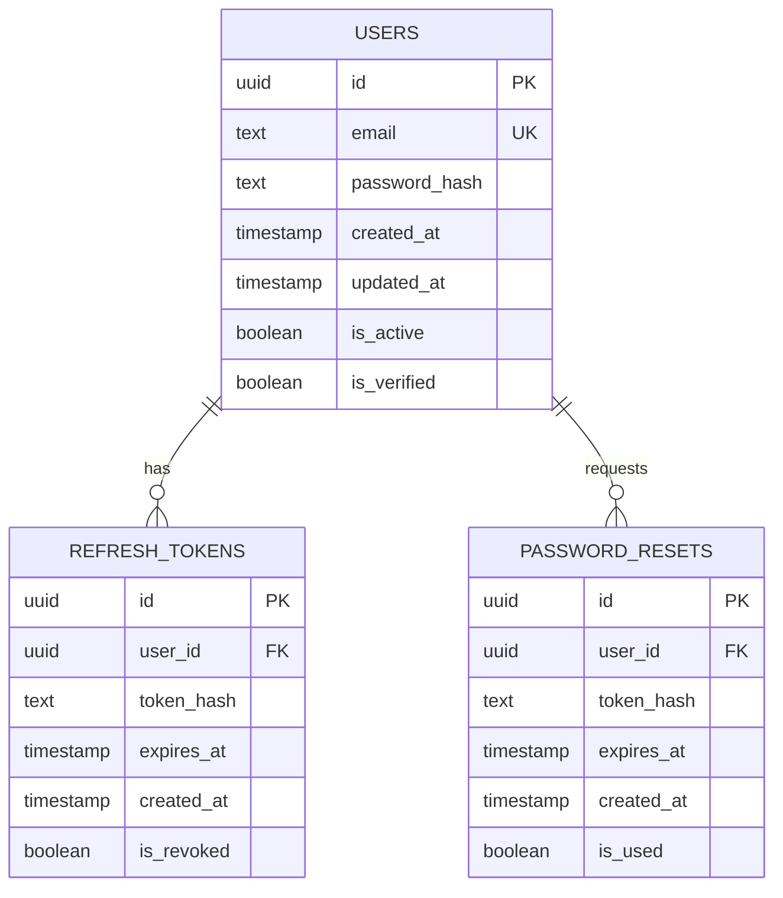

# Registration & Login System - Technical Architecture Document

## 1. Architecture design



## 2. Technology Description
- Frontend: React@18 + TypeScript + React Hook Form + Next.js
- Backend: FastAPI + Pydantic + SQLAlchemy + bcrypt + python-jose
- Database: PostgreSQL
- Authentication: JWT tokens with refresh token rotation
- Password Security: bcrypt hashing with salt rounds

## 3. Route definitions
| Route | Purpose |
|-------|---------|
| /register | Registration page with signup form |
| /login | Login page with authentication form |
| /reset-password | Password reset request page |
| /reset-password/[token] | Password reset confirmation page |
| /dashboard | Protected dashboard (post-authentication) |

## 4. API definitions

### 4.1 Core API

User registration endpoint
```
POST /api/auth/register
```

Request:
| Param Name | Param Type | isRequired | Description |
|------------|------------|------------|-------------|
| email | string | true | User email address (validated format) |
| password | string | true | User password (min 8 chars, mixed case, numeric, special) |

Response:
| Param Name | Param Type | Description |
|------------|------------|-------------|
| id | string | Generated user UUID |
| email | string | Registered email address |
| created_at | string | Account creation timestamp |

Example Request:
```json
{
  "email": "trader@example.com",
  "password": "SecurePass123!"
}
```

Example Response (201 Created):
```json
{
  "id": "550e8400-e29b-41d4-a716-446655440000",
  "email": "trader@example.com",
  "created_at": "2024-01-15T10:30:00Z"
}
```

Error Response (409 Conflict):
```json
{
  "error": "Email already registered"
}
```

User login endpoint
```
POST /api/auth/login
```

Request:
| Param Name | Param Type | isRequired | Description |
|------------|------------|------------|-------------|
| email | string | true | User email address |
| password | string | true | User password (plain text) |

Response:
| Param Name | Param Type | Description |
|------------|------------|-------------|
| access_token | string | JWT access token (15min expiry) |
| refresh_token | string | JWT refresh token (7 days expiry) |
| token_type | string | Token type ("bearer") |
| user | object | User profile information |

Password reset request
```
POST /api/auth/reset-password
```

Request:
| Param Name | Param Type | isRequired | Description |
|------------|------------|------------|-------------|
| email | string | true | User email address |

Password reset confirmation
```
POST /api/auth/reset-password/confirm
```

Request:
| Param Name | Param Type | isRequired | Description |
|------------|------------|------------|-------------|
| token | string | true | Reset token from email |
| new_password | string | true | New password (validated) |

## 5. Server architecture diagram



## 6. Data model

### 6.1 Data model definition



### 6.2 Data Definition Language

Users Table (users)
```sql
-- Create users table
CREATE TABLE users (
    id UUID PRIMARY KEY DEFAULT gen_random_uuid(),
    email VARCHAR(255) UNIQUE NOT NULL,
    password_hash VARCHAR(255) NOT NULL,
    created_at TIMESTAMP WITH TIME ZONE DEFAULT NOW(),
    updated_at TIMESTAMP WITH TIME ZONE DEFAULT NOW(),
    is_active BOOLEAN DEFAULT TRUE,
    is_verified BOOLEAN DEFAULT FALSE
);

-- Create indexes
CREATE INDEX idx_users_email ON users(email);
CREATE INDEX idx_users_created_at ON users(created_at DESC);

-- Create trigger for updated_at
CREATE OR REPLACE FUNCTION update_updated_at_column()
RETURNS TRIGGER AS $$
BEGIN
    NEW.updated_at = NOW();
    RETURN NEW;
END;
$$ language 'plpgsql';

CREATE TRIGGER update_users_updated_at BEFORE UPDATE ON users
    FOR EACH ROW EXECUTE FUNCTION update_updated_at_column();
```

Refresh Tokens Table (refresh_tokens)
```sql
-- Create refresh_tokens table
CREATE TABLE refresh_tokens (
    id UUID PRIMARY KEY DEFAULT gen_random_uuid(),
    user_id UUID NOT NULL REFERENCES users(id) ON DELETE CASCADE,
    token_hash VARCHAR(255) NOT NULL,
    expires_at TIMESTAMP WITH TIME ZONE NOT NULL,
    created_at TIMESTAMP WITH TIME ZONE DEFAULT NOW(),
    is_revoked BOOLEAN DEFAULT FALSE
);

-- Create indexes
CREATE INDEX idx_refresh_tokens_user_id ON refresh_tokens(user_id);
CREATE INDEX idx_refresh_tokens_expires_at ON refresh_tokens(expires_at);
CREATE INDEX idx_refresh_tokens_token_hash ON refresh_tokens(token_hash);
```

Password Resets Table (password_resets)
```sql
-- Create password_resets table
CREATE TABLE password_resets (
    id UUID PRIMARY KEY DEFAULT gen_random_uuid(),
    user_id UUID NOT NULL REFERENCES users(id) ON DELETE CASCADE,
    token_hash VARCHAR(255) NOT NULL,
    expires_at TIMESTAMP WITH TIME ZONE NOT NULL,
    created_at TIMESTAMP WITH TIME ZONE DEFAULT NOW(),
    is_used BOOLEAN DEFAULT FALSE
);

-- Create indexes
CREATE INDEX idx_password_resets_user_id ON password_resets(user_id);
CREATE INDEX idx_password_resets_token_hash ON password_resets(token_hash);
CREATE INDEX idx_password_resets_expires_at ON password_resets(expires_at);

-- Initial admin user (optional)
INSERT INTO users (email, password_hash, is_verified) VALUES 
('admin@trading-platform.com', '$2b$12$example_hash_here', TRUE);
```