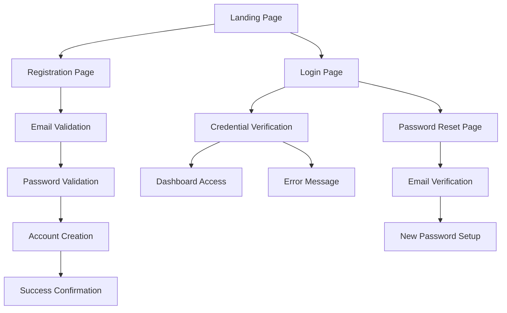

# Registration & Login System - Product Requirements Document

## 1. Product Overview
Implement a secure user registration and authentication system for the trading platform, enabling traders to create accounts and access platform features safely.

The system addresses the core need for user identity management, allowing new users to register with email/password credentials while ensuring existing users can authenticate securely. This foundational feature enables personalized trading experiences and secure access control.

## 2. Core Features

### 2.1 User Roles
| Role | Registration Method | Core Permissions |
|------|---------------------|------------------|
| Trader | Email registration with password | Can access trading platform, manage watchlists, execute trades |
| Admin | System-level creation | Full platform access, user management, system configuration |

### 2.2 Feature Module
Our registration and login system consists of the following main pages:
1. **Registration page**: signup form, email validation, password strength requirements, confirmation fields.
2. **Login page**: authentication form, session management, error handling.
3. **Password reset page**: forgot password flow, email verification, new password setup.

### 2.3 Page Details
| Page Name | Module Name | Feature description |
|-----------|-------------|---------------------|
| Registration page | Signup form | Collect email, password, confirm password with real-time validation |
| Registration page | Email validation | Verify email format and check for existing accounts |
| Registration page | Password requirements | Enforce 8+ characters, mixed-case, numeric, special character rules |
| Registration page | Error handling | Display validation errors and server-side conflict messages |
| Login page | Authentication form | Accept email/password credentials for user login |
| Login page | Session management | Create secure sessions and handle authentication tokens |
| Login page | Error feedback | Show invalid credential messages and account status |
| Password reset page | Reset request | Allow users to request password reset via email |
| Password reset page | Email verification | Send secure reset links with expiration |
| Password reset page | New password setup | Enable users to set new passwords with validation |

## 3. Core Process
**User Registration Flow:**
1. User navigates to registration page
2. User enters email, password, and confirms password
3. System validates input in real-time (email format, password strength, confirmation match)
4. User submits form
5. System checks for existing email in database
6. If email exists, show error message
7. If new email, hash password and create user record
8. Return success confirmation with user ID

**User Login Flow:**
1. User navigates to login page
2. User enters email and password
3. System validates credentials against stored hash
4. If valid, create session and redirect to dashboard
5. If invalid, show error message

## 4. User Interface Design
### 4.1 Design Style
- Primary colors: Dark theme (#0b0f14 background, #4f9cff accent)
- Secondary colors: #121822 panels, #e6e9ef text, #9aa4b2 muted
- Button style: Rounded corners (8px), solid fills with hover effects
- Font: System fonts, 14px base size, 16px for inputs
- Layout style: Centered card-based forms with clean spacing
- Icon style: Outline icons for form fields, solid for actions

### 4.2 Page Design Overview
| Page Name | Module Name | UI Elements |
|-----------|-------------|-------------|
| Registration page | Signup form | Centered card (400px max-width), white background, input fields with labels, primary button |
| Registration page | Validation feedback | Inline error messages in red (#f87171), success indicators in green |
| Registration page | Password strength | Progress bar showing strength level, requirement checklist |
| Login page | Authentication form | Similar card layout, email and password fields, remember me checkbox |
| Login page | Error display | Alert banner for authentication errors, forgot password link |
| Password reset page | Reset form | Single email input, clear instructions, confirmation messaging |

### 4.3 Responsiveness
Desktop-first design with mobile adaptation. Forms maintain 400px max-width on desktop, scale to full-width with padding on mobile. Touch-friendly button sizes (44px minimum) and optimized input field spacing for mobile devices.